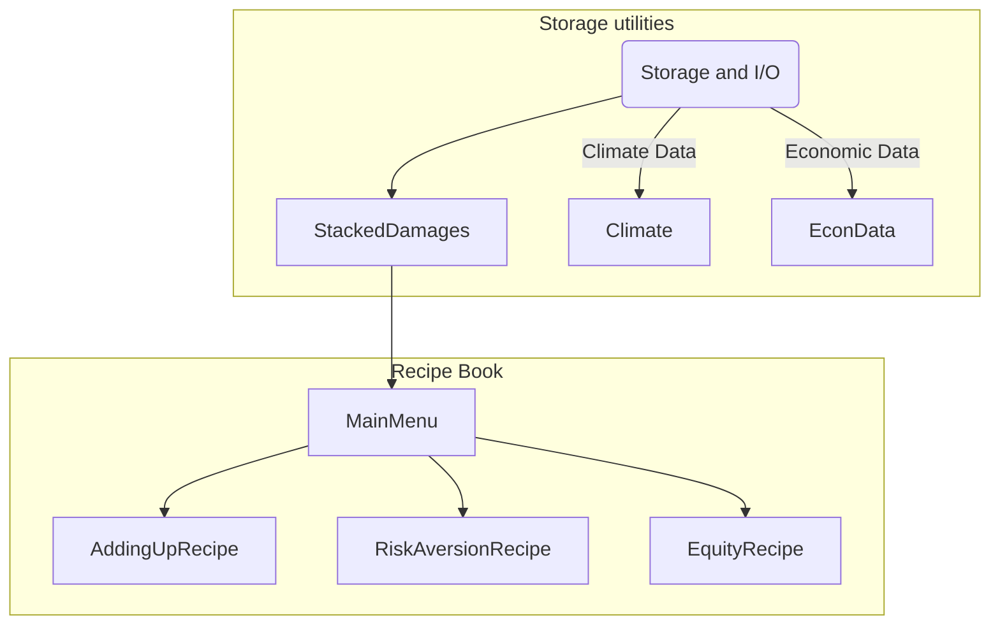

# DSCIM: The Data-driven Spatial Climate Impact Model

This Python library enables the calculation of sector-specific partial social cost of greenhouse gases (SC-GHG) and SCGHGs that are combined across sectors using a variety of valuation methods and assumptions. The main purpose of this
library is to parse the monetized spatial damages from different sectors and integrate them
using different options ("menu options") that encompass different decisions, such as
discount levels, discount strategies, and different considerations related to
economic and climate uncertainty.

## Installation

Install with `pip` using:
```shell
pip install dscim
```

Install the unreleased bleeding-edge version of the package with:
```shell
pip install git+https://github.com/climateimpactlab/dscim
```

### Dependencies

`dscim` requires Python > 3.8. Additional compiled packages are required so we recommend installing `dscim` into a `conda` environment along with its dependencies.

- numpy
- pandas
- xarray
- matplotlib
- dask
- distributed
- requests
- statsmodels
- click
- zarr
- dask-jobqueue
- seaborn
- geopandas
- netcdf4
- h5netcdf
- impactlab-tools
- p_tqdm

## Support
Source code is available online at https://github.com/climateimpactlab/dscim. Please file bugs in the [bug tracker](https://github.com/climateimpactlab/dscim/issues).

This software is Open Source and available under the Apache License, Version 2.0.

## Structure and logic

The library is split into several components that implement the hierarchy
defined by the menu options. These are the main elements of the library and
serve as the main classes to call different menu options.



`StackedDamages` takes care of parsing all monetized damage data from several
sectors and read the data using a `dask.distributed.Client`. At the same time,
this class takes care of ingesting FaIR GMST and GMSL data needed to draw damage
functions and calculate FaIR marginal damages to an additional emission of
carbon. The data can be read using the following components: 

Class            | Function                                                                                                                                                                                                                                                                                                                                                                                           |
|------------------|----------------------------------------------------------------------------------------------------------------------------------------------------------------------------------------------------------------------------------------------------------------------------------------------------------------------------------------------------------------------------------------------------|
| `Climate`        | Wrapper class to read all things climate, including GMST and GMSL. You  can pass a `fair_path` with a NetCDF with FaIR control and pulse simulations and median FaIR runs. You can use `gmst_path` to input a  CSV file with model and year anomaly data, for fitting the damage functions. |
| `EconVars`       | Class to ingest sector path related data, this includes GDP and population data. Some intermediate variables are also included in this class, check the documentation for more details                                                                                                                                                                                                             |
| `StackedDamages` | Damages wrapper class. This class contains all the elements above and  additionally reads all the computed monetized damages. A single path is needed to read all damages, and sectors must be separated by folders.  If necessary, the class will save data in `.zarr` format to make chunking operations more efficient. Check documentation of the class for more details.                      |


and these elements can be used for the menu options: 
 - `AddingUpRecipe`: Adding up all damages and collapse them to calculate a general SCC without valuing uncertainty.
 - `RiskAversionRecipe`: Add risk aversion certainty equivalent to consumption calculations - Value uncertainty over econometric and climate draws.
 - `EquityRecipe`: Add risk aversion and equity to the consumption calculations. Equity includes taking a certainty equivalent over spatial impact regions.

